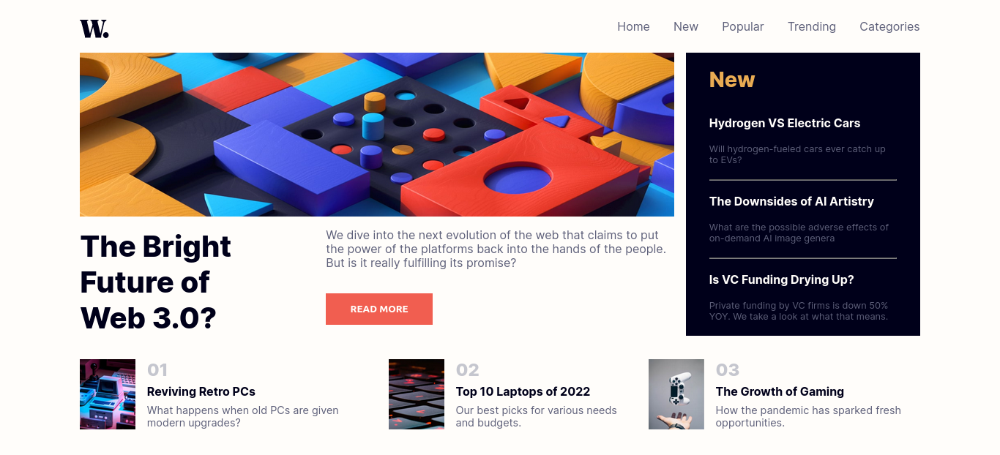
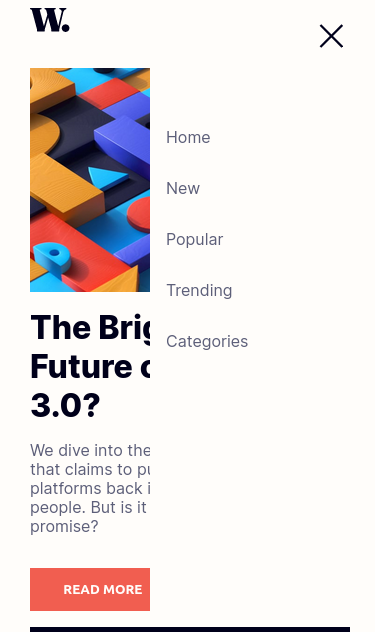

# Frontend Mentor - News homepage solution

This is a solution to the [News homepage challenge on Frontend Mentor](https://www.frontendmentor.io/challenges/news-homepage-H6SWTa1MFl). Frontend Mentor challenges help you improve your coding skills by building realistic projects.

## Table of contents

- [Overview](#overview)
  - [Screenshot](#screenshot)
  - [Links](#links)
  - [Built with](#built-with)
  - [What I learned](#what-i-learned)
  - [Continued development](#continued-development)
  - [Author](#author)

## Overview

### Screenshot




### Links

- Solution URL: (https://github.com/Yab1/news-homepage)
- Live Site URL: (https://yab1.github.io/news-homepage/)

### Built with

- Semantic HTML5 markup
- CSS custom properties
- JS basic

### What I learned

```html
<picture>
  <source
    srcset="assets/images/image-web-3-mobile.jpg"
    media="(max-width:376px)"
  />
  
</picture>
learned about aria -aria-controls -aria-expanded
```

```css

```

```js
navToggle.setAttribute("aria-expanded", true);
```

### Continued development

- Semantic HTML5 markup
- Flexbox
- CSS Grid
- Mobile-first workflow

## Author

- Frontend Mentor - [@Afro Habesha](https://www.frontendmentor.io/profile/AfroHabesha)
